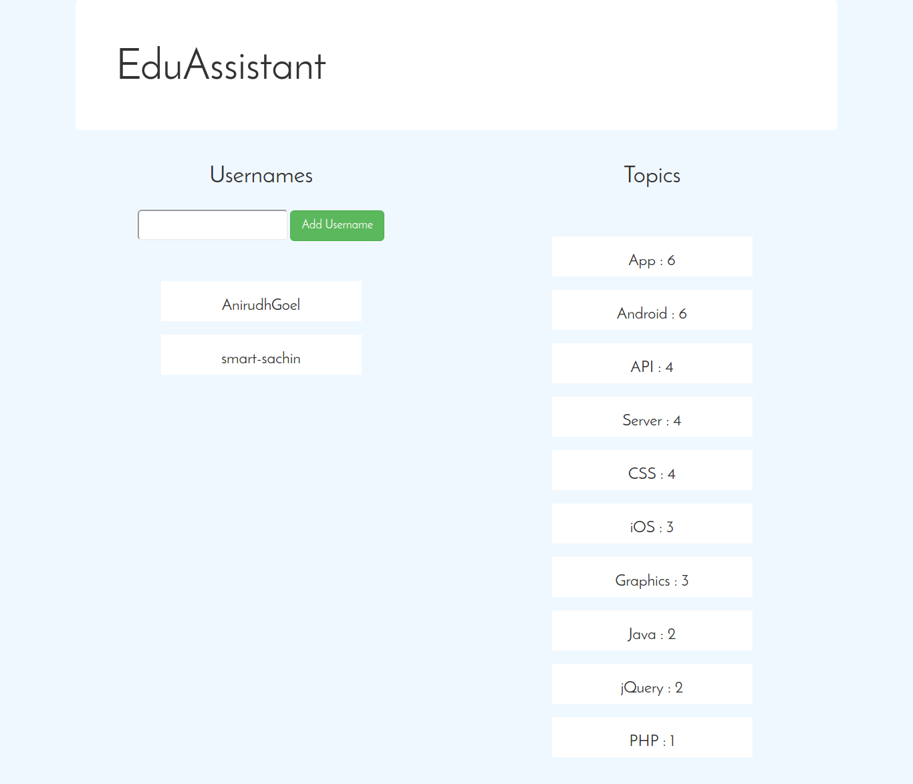

# Interests-Ranker
A webapp which parses multiple users' Github Readmes to rank their passion and interests.

# Usage
This app can be used for multiple purposes such as -
* Finding common interests of a group of people for deciding topics for workshops, educational sessions and other activities.
* Finding strengths of teams in Hackathons or other competitions.

# Screenshot

--------------------------

Contact me via [email](http://scr.im/3hmx).